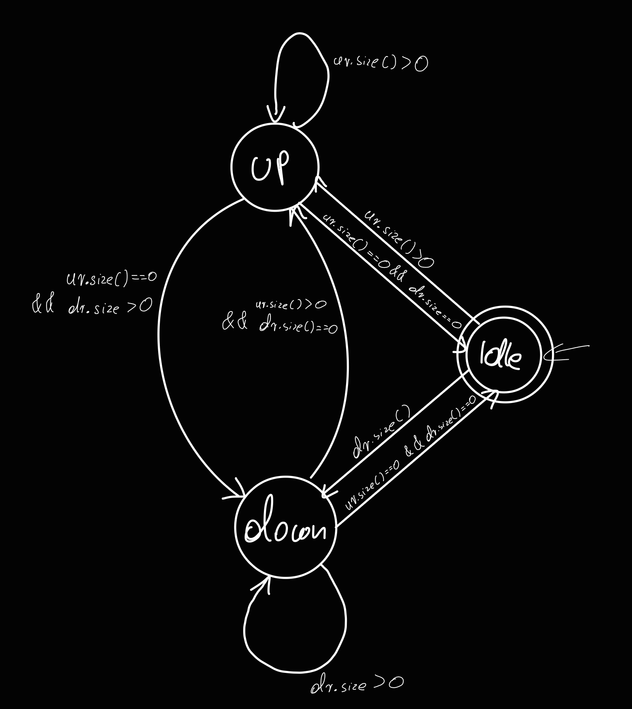
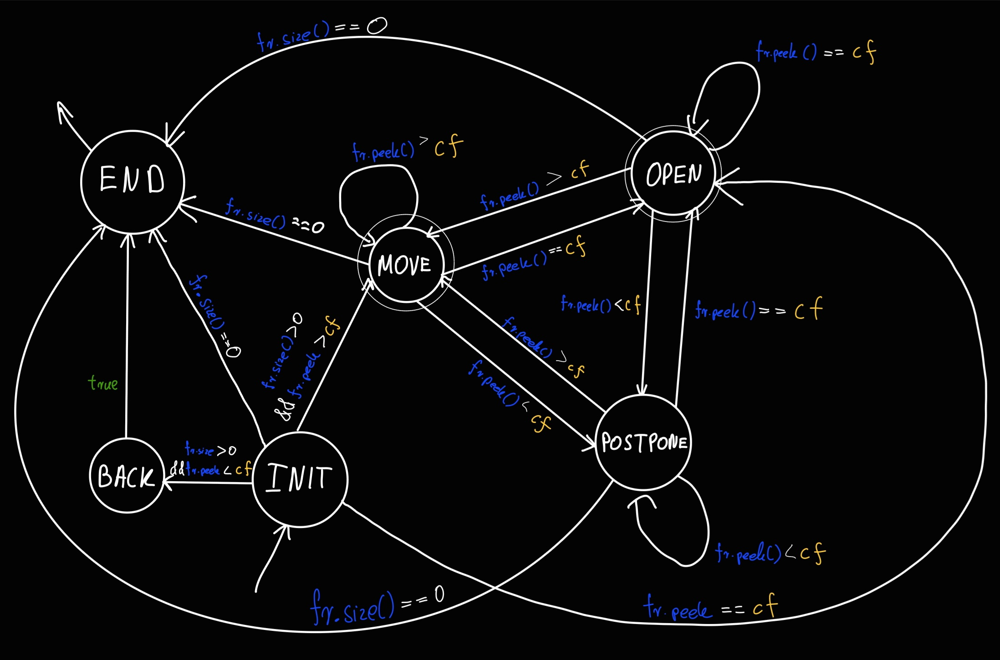

# Elevator System


https://github.com/xramzesx/elevator-system/assets/46059547/c6c3e6a1-8772-48ef-b1da-d980b6c03a06


System symulujący pracę do 16 wind równocześnie, wykorzystujących jeden wspólny panel.

# Wykorzystane technologie:

## Frontend:
- HTML/CSS/JavaScript
- TypeScript
- React
- React Router
- styled-components
- Material UI

## Backend:
- Java
- Maven
- Spring (web server)
- JUnit
- Docker

# Wymagania

- OS: `Windows 10+/Linux`
- Software: 
    - Java: OpenJDK 20.0.1
    - Node: v17.0.1+
    - `docker` (opcjonalnie)

# Uruchamianie

Aplikację można uruchomić na dwa sposoby - uruchamiając każdą z aplikacji z osobna lub poprzez kontenery dockera.

## Manualnie (bez korzystania z `docker`)

### Uruchamianie klienta

Aby uruchomić klienta, należy w katalogu `/client` uruchomić poniższe polecenia:

```
npm install
npm start
```

### Uruchamianie serwera

Serwer uruchomić można na kilka sposobów. Jednym z nich jest zaimportowanie jako projektu katalogu do IntelliJ i uruchomić bezpośrednio z IDE. Można też uruchomić serwer przy pomocy Maven, kompilując najpierw projekt poleceniem:

```
mvn clean install
```

A następnie uruchamiając polecenie:
```
java -jar ./target/server-0.0.1-SNAPSHOT.jar
```

Domyślnie serwer zostanie uruchomiony pod adresem: `http://localhost:8080`

## Wykorzystując `docker`

Aby uruchomić aplikację z wykorzystaniem dockera, w głównym katalogu należy najpierw doinstalować brakujące pakiety:

```bash
npm install 
```

A następnie uruchomić aplikację, poprzez polecenie

```bash
npm start
```

Powyższa komenda najpierw zbuduje plik .jar serwera, a następnie uruchomi docker-compose.
Ze względu na konieczność pobrania zależności Maven, pierwsze uruchomienie może zająć trochę czasu. 

Gdy już raz skompilujemy jar (będzie się on znajdował w `server/target/server-0.0.1-SNAPSHOT.jar`), możemy uruchomić kontenery poleceniem:

```bash
docker compose up
```

# Opis projektu

# Elevator

Klasa modelująca schemat działań pojedynczej windy. Wyróżniamy wśród nich dwa rodzaje:
- FCFS
- SCAN

## FCFS

Winda przemieszcza się wg kolejności zgłoszeń. Każde nowe zgłoszenie jest dodawane na koniec kolejki, bez względu na to, czy zostało ono zgłoszone z wnętrza windy bądź z zewnątrz windy.

## SCAN

Winda tego typu do swojego działania wykorzystuje poniższe maszyny stanu, zaimplementowane w Javie za pomocą wzorca State. Cały algorytm możemy podzielić na dwa automaty/maszyny stanu:
- `Główna maszyna stanu`
- `Submaszyna stanu` 

### Główna maszyna stanu

Główny automat odpowiedzialny jest za utrzymanie cyklicznego przemieszczania się windy, w momencie gdy posiada aktywne zgłoszenia.



Oznaczenia:
- `ur` - `upwardRequests` - zgłoszenia w górę
- `dr` - `downwardRequests` - zgłoszenia w dół

### Stany głównej maszyny:
- `IDLE` - stan początkowy windy
    - Jeśli są zgłoszenia w górę (`upwardRequests`), przejdź do `UP`
    - Jeśli są zgłoszenia w dół (`downwardRequests`), przejdź do stanu `DOWN`
    - Jeśli nie ma zgłoszeń, zostań na `IDLE`
- `UP` - Winda porusza się w górę
    - Jeśli są zgłoszenia w górę (`upwardRequests`), przejdź do `UP`
    - Jeśli nie ma zgłoszeń w górę (`upwardRequests`) i są zgłoszenia w dół (`downwardRequests`), przejdź do stanu `DOWN`
    - Jeśli nie ma zgłoszeń, przejdź do `IDLE`
- `DOWN` - Winda porusza się w dół
    - Jeśli są zgłoszenia w dół (`downwardRequests`), przejdź do stanu `DOWN`
    - Jeśli nie ma zgłoszeń w dół (`downwardRequests`) i są zgłoszenia w górę (`upwardRequests`), przejdź do `UP`
    - Jeśli nie ma zgłoszeń, przejdź do `IDLE`

#### Dodatkowe założenia
- `upwardRequests` oraz `downwardRequests` są kolejkami priorytetowymi, nie zawierającymi duplikatów.

### Submaszyna stanu

Wewnątrz stanów `UP` oraz `DOWN` znajdują się kolejne submaszyny, odpowiedzialne za realizację rządań w odpowiedniej kolejności


Oznaczenia:
- `fr` - `forwardRequests` - zgłoszenia zgodne z kierunkiem
- `br` - `backwardRequests` - zgłoszenia przeciwne do kierunku
- `cf` - `currentFloor` - aktualne piętro 

### Stany submaszyny:
- `INIT`- stan rozpoczynający pracę całego automatu. 
    - Jeśli nie ma zgłoszeń, przejdź do `END` 
    - Jeśli są zgłoszenia i pierwsze z nich znajduje się z piętra przed aktualnym, przejdź do `BACK`
    - Jeśli są zgłoszenia i pierwsze z nich znajduje się dalej niż obecne piętro, przejdź do `MOVE` 
- `BACK` - Dodajemy zgłoszenie do `backwardRequests` i przechodzimy do `END`
- `MOVE` - Przejdź o jedną jednostkę w kierunku docelowego piętra.
    - Jeśli jeśli rządanie jest z piętra przed aktualnym, przejdź do `POSTPONE`. 
    - Jeśli jest on dalej niż obecne piętro, przejdź do `MOVE`. 
    - Jeśli jest na tym samym piętrze, przejdź do `OPEN`. 
    - Jeśli nie ma zgłoszeń, przejdź do `END` 
- `OPEN` - Otwórz drzwi na aktualnym piętrze
    - Jeśli jeśli rządanie jest z piętra przed aktualnym, przejdź do `POSTPONE`. 
    - Jeśli jest on dalej niż obecne piętro, przejdź do `MOVE`. 
    - Jeśli jest na tym samym piętrze, przejdź do `OPEN`. 
    - Jeśli nie ma zgłoszeń, przejdź do `END` 
- `POSTPONE` - Odkładamy pierwsze rządanie z `fr` do kolejki `postponedRequests`
    - Jeśli jeśli rządanie jest z piętra przed aktualnym, przejdź do `POSTPONE`. 
    - Jeśli jest on dalej niż obecne piętro, przejdź do `MOVE`. 
    - Jeśli jest na tym samym piętrze, przejdź do `OPEN`. 
    - Jeśli nie ma zgłoszeń, przejdź do `END` 
- `END` - Dodajemy wszystkie zgłoszenia z kolejki `postponedRequests` i kończymy pracę automatu

#### Dodatkowe założenia:
- tylko dla stanu `OPEN` funkcja `SCANElevator.isOpen()` zwraca `true`. W przeciwnym razie zwraca `true`
- gdy dojdziemy do stanu `MOVE`, sprawdzamy odrazu, czy doszliśmy do naszej destynacji. Jeśli tak, to przechodzimy odrazu do stanu `OPEN`
### Opis

Winda rozpatruje najpierw zgłoszenia w jedna stronę, a następnie zgłoszenia w drugą strone. Najwyższy priorytet w przypadku tego rodzaju windy posiadają zgłoszenia, które równocześnie:
- dotyczą tego samego kierunku, w którym aktualnie dana winda się znajduje
- są najbliżej aktualnej windy*

Początkowo winda jest w stanie `IDLE`. W momencie otrzymania zgłoszenia, winda rozpoczyna swój cykl od zgłoszeń w górę (`UP`).

*Winda jako pierwsze zgłoszenie zawsze rozpatruje zgłoszenie z najniższego piętra (dla stanu `UP`) lub zgłoszenie z najwyższego piętra (dla stanu `DOWN`). Jeśli pierwsze rozpatrywane piętro z danego kierunku znajduje się niżej niż winda (dla stanu `UP`) bądź wyżej (dla stanu `DOWN`), winda dodaje nowe rządanie w przeciwnym kierunku i zmienia stan na przeciwny

Do przechowywania zgłoszeń w góre (`upwardRequests`) oraz w dół (`downwardRequests`) wykorzystujemy strukturę TreeSet. Pełni ona funkcję kolejki priorytetowej, jednocześnie zapewniającej unikalność zgłoszeń. Dla `upwardRequests.peek()` zwraca zgłoszenie w górę z najniższego piętra, natomiast `downwardRequests.peek()` zwraca zgłoszenie w dół z najniższego piętra.

# ElevatorFactory

Klasa implementująca wzorzec Factory Method, słuząca do generowania odpowiedniej liczby wind konkretnego typu. Klasa ta może generować windy różnych rodzajów - wszystko zależy od logiki danej subklasy.

Obecnie są zaimplementowane dwie fabryki:
- `SCANElevatorFactory` - fabryka generująca tylko windy typu `SCANElevator` (domyślna fabryka)
- `FCFSElevatorFactory` - fabryka generująca tylko windy typu `FCFSElevator`

# ElevatorPickupStrategy

Klasa implementująca wzorzec Strategy. Odpowiada za obsługę wszystkich wind z poziomu jednego wspólnego panelu - obsługę zgłoszeń z zewnątrz i wewnątrz windy. Wśród nich znajdują się dwie strategie:
- `BestCostPickupStrategy` - Zgłoszenie przyjmuje winda, która jest najbliżej piętra zgłoszenia. (domyślna strategia, przeznaczona dla `SCANElevator`) 
    - Jeśli jest kilka takich wind, wybiera tą, która:
        - posiada kierunek zgodny z kierunkiem żądania lub 
        - która posiada mniej zgłoszeń
- `LeastBusyPickupStrategy` - Zgłoszenie otrzymuje winda z najmniejszą liczbą aktualnie przetwarzanych zgłoszeń (strategia przeznaczona dla `FCFSElevator`)

Dodatkowo strategie mogą różnić się w zależności od wyboru pierwszej rozpatrywanej windy. Powyższe warianty są zaimplementowane jako subklasy subklas ElevatorStrategy (w naszym przypadku dla `BestCostPickupStrategy`)
- `Default` - pierwszą windą jest pierwsza winda od lewej strony (z indexem `0`). (domyślne zachowanie strategii)
- `Balanced` - pierwszą windą dla i-tego kroku jest winda o indexie `i % elevatorsCount`
- `Randomized` - pierwsza winda jest wybierana w sposób losowy

# ElevatorSystem

Klasa zarządzająca systemem wind. W konstruktorze otrzymuje strategię obsługi wind `ElevatorPickupStrategy` oraz fabrykę, generującą windy `ElevatorFactory`. Klasa ta jest przystosowana do pracy na wielu wątkach.

# ElevatorSimulation

Klasa odpowiedzialna za symulację windy w czasie rzeczywistym. Do jej działania potrzebne jest dostarczenie konfiguracji za pomocą rekordu `ElevatorSimulationConfig`.

# SimulationManager 

Singleton, zarządzający wszystkimi symulacjami na serwerze. Jest on przystosowany do pracy na wielu wątkach. To do niego są kierowane zapytania wewnątrz kontrolerów HTTP.

# FAQ

1. Jak zachowa się winda, jeśli jedzie nią wiele osób i każdy z nich ma różne piętro docelowe?

Zachowanie windy zależy od jej typu. Szczegółowo zostało to opisane przy okazji opisu każdego z nich, TL;DR:
- `FCFS` - będzie rozpatrywał zgłoszenia zgodnie z kolejnością ich wprowadzenia
- `SCAN` - będzie rozpatrywał w pierwszej kolejności zgłoszenia będące "po drodze" zgodne z aktualnym kierunkiem ruchu windy. Po dojściu do końca, rozpoczyna się rozpatrywawnie wszystkich otrzynanych w przeciwną stronę zgłoszeń. Następnie znów zmieni kierunek i rozpatrzy wszystkie (pozostałe oraz otrzymane w międzyczasie) zgłoszenia w pierwotnym kierunku, zapętlając tym samym cykl.

2. Kiedy i jak dokonujemy wyboru piętra?

Wybór piętra dokonywany jest przed wykonaniem kroku symulacji (`step`). Wyboru piętra możemy dokonać za pomocą metody 

```java
ElevatorSystem.pickup(Integer floor, ElevatorDirection direction)
```

Natomiast wyboru piętra z wnętrza windy możemy dokonać za pomocą metody:

```java
ElevatorSystem.pickupInside(Integer floor, Integer elevatorId)
```

Po stronie samej instancji windy realizowane jest to w następujący sposób:

- Do wezwania windy wykorzystujemy metodę 
```java
Elevator.pickup(Integer floor, ElevatorDirection direction)
```

- Natomiast do wezwania windy z wewnątrz niej wykorzystujemy poniższą metodę

```java
Elevator.pickup(Integer floor)
```

